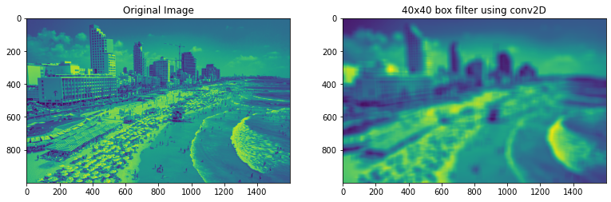
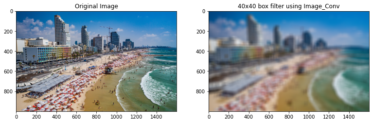
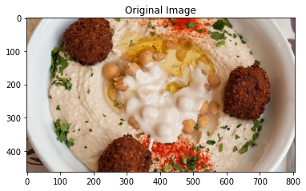
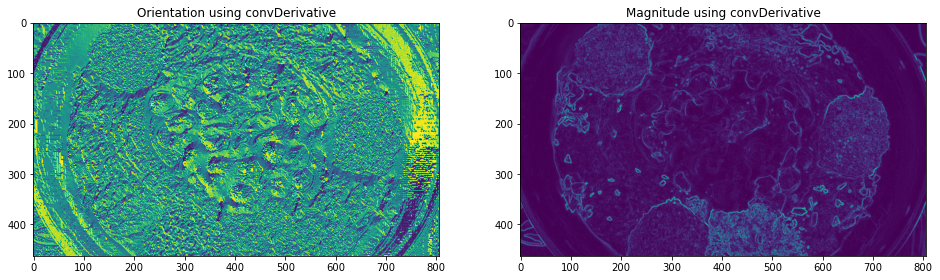
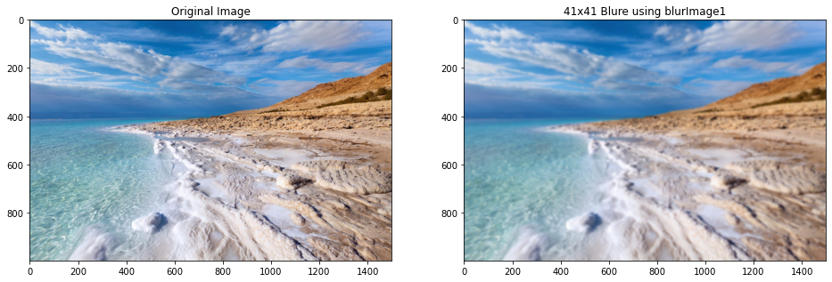
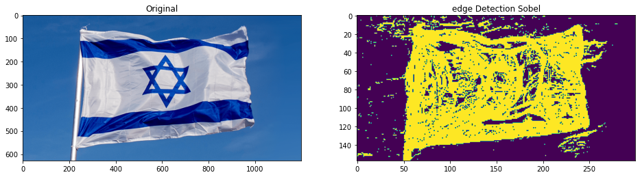
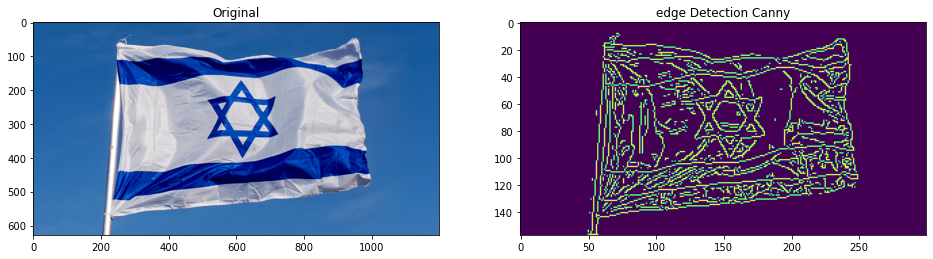

# Convolution & Edge Detection
The purpose of this repository is to demonstrate the concept of the convolution and edge
detection by performing simple manipulations on images, without use of any Image processing libraries.

This repository covers:
- Implementing convolution on 1D and 2D arrays
- Performing image derivative and image blurring
- Sobel Edge detection 
- Canny Edge detection

## Reading an image into a given representation
a function that reads a given image file and converts it into a given representation. 

Nocite that the output image is represented by a matrix of class float with intensities (ei-
their grayscale or RGB channel intensities) normalized to the range [0; 1].


```python
from typing import List
import numpy as np
import cv2
import matplotlib.pyplot as plt
%matplotlib inline

LOAD_GRAY_SCALE = 1
LOAD_RGB = 2
IMG_INT_MAX_VAL = 255

def imReadAndConvert(filename: str, representation: int) -> np.ndarray:
    """
    Reads an image, and returns the image converted as requested
    :param filename: The path to the image
    :param representation: GRAY_SCALE or RGB
    :return: The image object
    """
    img = cv2.imread(filename, -1)
    if representation is LOAD_RGB:
        img = cv2.cvtColor(img, cv2.COLOR_BGR2RGB)

    # Normalize to range [0,1]
    img = img.astype(float) / IMG_INT_MAX_VAL

    if representation is LOAD_GRAY_SCALE \
            and len(img.shape) > 2:
        b, g, r = np.split(img, 3, axis=2)
        img = 0.3 * r + 0.59 * g + 0.11 * b
        img = img.squeeze()
    elif representation is LOAD_RGB \
            and len(img.shape) < 3:
        img = np.stack((img, img, img), axis=2)
    return img
```

## Convolution

### 1D Convolution
 function that implement convolution of 1 1D discrete signals.


```python
def conv1D(in_signal: np.ndarray, kernel: np.ndarray) -> np.ndarray:
    """
    Convolve a 1-D array with a given kernel
    :param in_signal: 1-D array
    :param kernel: 1-D array as a kernel
    :return: The convolved array
    """
    if len(in_signal.shape) > 1:
        if in_signal.shape[1] > 1:
            raise ValueError("Input Signal is not a 1D array")
        else:
            in_signal = in_signal.reshape(in_signal.shape[0])
            
    inv_k = kernel[::-1].astype(np.float64)
    kernel_len = len(kernel)
    out_len = max(kernel_len, len(in_signal) + (kernel_len - 1))
    padding = kernel_len - 1
    padded_signal = np.pad(in_signal, padding, 'constant')

    out_signal = np.ones(out_len)
    for i in range(out_len):
        st = i
        end = i + kernel_len
        out_signal[i] = (padded_signal[st:end] * inv_k).sum()
    return out_signal
```


```python
signal = np.array([1.1, 1, 3, 4, 5, 6, 2, 1])
kernel = np.array([1, 2, 2, 1])
sig_conv = conv1D(signal, kernel).astype(int)
sig_conv = conv1D(signal, kernel)
print("Signal:\t{}".format(signal))
print("np.convolve Result:\t{}".format(np.convolve(signal, kernel, 'full')))
print("conv1D Result:     \t{}".format(sig_conv))
```

    Signal:	[1.1 1.  3.  4.  5.  6.  2.  1. ]
    np.convolve Result:	[ 1.1  3.2  7.2 13.1 20.  27.  28.  22.  12.   4.   1. ]
    conv1D Result:     	[ 1.1  3.2  7.2 13.1 20.  27.  28.  22.  12.   4.   1. ]
    

### 2D Convolution
 function that implement convolution of  2D discrete signals. (also works on Gray-scale Image)


```python
def conv2D(in_image: np.ndarray, kernel: np.ndarray) -> np.ndarray:
    """
    Convolve a 2-D array with a given kernel
    :param in_image: 2D image
    :param kernel: A kernel
    :return: The convolved image
    """
    img_h, img_w = in_image.shape[:2]
    kernel_shape = np.array([x for x in kernel.shape])
    mid_ker = kernel_shape // 2
    padded_signal = np.pad(in_image.astype(np.float32),
                           ((kernel_shape[0], kernel_shape[0]),
                            (kernel_shape[1], kernel_shape[1]))
                           , 'edge')

    out_signal = np.zeros_like(in_image)
    for i in range(img_h):
        for j in range(img_w):
            st_x = j + mid_ker[1] + 1
            end_x = st_x + kernel_shape[1]
            st_y = i + mid_ker[0] + 1
            end_y = st_y + kernel_shape[0]
            out_signal[i, j] = (padded_signal[st_y:end_y, st_x:end_x] * kernel).sum()
    return out_signal
```


```python
# LOAD IMAGE:
img = imReadAndConvert('TLV_beach.jpg',1)

# SET KERNEL:
kernel = np.ones((40, 40))
kernel = kernel / kernel.sum()

# PERFORM CONVOLUTION USING CONV2D:
c_img = conv2D(img, kernel) / 255

# DISPLAY RESULTS:
f, ax = plt.subplots(1, 2,figsize=(13, 13))
ax[0].imshow(img)
ax[0].set_title('Original Image')  
ax[1].imshow(c_img)
ax[1].set_title('40x40 box filter using conv2D')
plt.show()
```


    

    


### Image Convolution
 function that implement 2D convolution on RGB or Gray Scale Image.


```python
def Image_Conv(image: np.ndarray, kernel: np.ndarray) -> np.ndarray:
    
    """
    Convolve a 3D array image, for each channel separately with a given kernel
    :param in_image: 2D image (RBG or Gray-Scale)
    :param kernel: A kernel
    :return: The convolved image
    """
    if len(image.shape) == 2:
        conv_image = conv2D(image, kernel)
    else:
        conv_image = np.zeros_like(image)
        for channel in range(image.shape[2]):
            conv_image[:,:,channel] = conv2D(image[:,:,channel], kernel)
    return conv_image
```


```python
# LOAD IMAGE:
img = imReadAndConvert('TLV_beach.jpg',2)

# SET KERNEL:
kernel = np.ones((40, 40))
kernel = kernel / kernel.sum()

# PERFORM CONVOLUTION USING CONV2D:

c_img = Image_Conv(img, kernel) 

# DISPLAY RESULTS:
f, ax = plt.subplots(1, 2,figsize=(13, 13))
ax[0].imshow(img)
ax[0].set_title('Original Image')  
ax[1].imshow(c_img)
ax[1].set_title('40x40 box filter using Image_Conv')
plt.show()
```


    

    


## Image derivatives & blurring

### Derivatives

A function that computes the magnitude and the direction of an image gradient. The function derive
the image in each direction separately (rows and column) using simple convolution with $ [1,0,-1]^T $ and $ [1,0,-1] $ to get the two image derivatives. 

Next, these derivative images uesed for compute the magnitude and direction matrix and also the x and y derivatives.

The function use the following equations:

$ Mag_G  = ||G|| = \sqrt{I_x^2 + I_y^2}$

$ Direction_G = tan^-1(\frac{I_y}{I_x}) $ 


```python
def convDerivative(in_image: np.ndarray) -> (np.ndarray, np.ndarray):
    """
    Calculate gradient of an image
    :param in_image: Grayscale iamge
    :return: (directions, magnitude)
    """
    kernel = np.array([[1, 0, -1]])
    x_drive = conv2D(in_image, kernel)
    y_drive = conv2D(in_image, kernel.T)

    ori = np.arctan2(y_drive, x_drive)
    mag = np.sqrt(x_drive ** 2 + y_drive ** 2)

    return ori, mag
```


```python
img = imReadAndConvert('Humus.jpg',1)
ori, mag = convDerivative(img)

RGB_img = imReadAndConvert('Humus.jpg',2)  
plt.title('Original Image')
plt.imshow(RGB_img)
    
f, ax = plt.subplots(1, 2, figsize=(16, 16))
ax[0].set_title('Orientation using convDerivative')
ax[1].set_title('Magnitude using convDerivative')
ax[0].imshow(ori)
ax[1].imshow(mag)
plt.show()
```


    

    


    

    


### Blurring
Two functions that each performs image blurring using convolution between the image f and
a Gaussian kernel g. 

blurImage1 using conv2D and Gaussian kernel.

Comments:
- The Gaussian kernel contain approximation of the Gaussian distribution using the binomial coeficients. A consequent 1D convolutions of [1 1] with itself is an
elegant way for obtaining a row of the binomial coeficients. using the 1D binomial coeficients we can get a 2D Gaussian.

the kernel obey the below rule:

$ \sum \limits _{i,j} kernel_{i,j} = 1 $  

- The border of the images padded same as in the 'Convolution' section.
- The size of the Gaussian' kernelSize, is always an odd number.


```python
def createGaussianKernel(k_size: int):
    if k_size % 2 == 0:
        raise ValueError("Kernel size should be an odd number")
    k = np.array([1, 1], dtype=np.float64)
    iter_v = np.array([1, 1], dtype=np.float64)

    for i in range(2, k_size):
        k = conv1D(k, iter_v)
    k = k.reshape((len(k), 1))
    kernel = k.dot(k.T)
    kernel = kernel / kernel.sum()
    return kernel

def blurImage1(inImage: np.ndarray, kernelSize: int) -> np.ndarray:
    """
    Blur an image using a Gaussian kernel
    :param inImage: Input image
    :param kernelSize: Kernel size
    :return: The Blurred image
    """
    kernel = createGaussianKernel(kernelSize)
    if len(inImage.shape) == 2:
        return conv2D(inImage, kernel)
    else: 
        return Image_Conv(inImage, kernel)
```


```python
img = imReadAndConvert('Dead_Sea.jpg',2) 
k_size = 41
b1 = blurImage1(img, k_size)

f, ax = plt.subplots(1, 2, figsize=(16,16))
ax[0].imshow(img)
ax[0].set_title('Original Image')
ax[1].imshow(b1)
ax[1].set_title('41x41 Blure using blurImage1')

plt.show()
```


    

    


## Edge detection
implementation of the following functions:

- edgeDetectionSobel
- edgeDetectionZeroCrossingSimple
- edgeDetectionZeroCrossingLOG
- edgeDetectionCanny


```python
def getSobelMagOri(img: np.ndarray) -> (np.ndarray, np.ndarray):
    """
    Extracts the Magnitude and Orientations of deriving the image using the Sobel kernel
    :param img: The Image
    :return: Magnitud, Orientation
    """
    sobel_kernel = np.array([
        [-1, 0, 1],
        [-2, 0, 2],
        [-1, 0, 1],
    ]).astype(np.float64)[::-1] / 8.0

    i_x = conv2D(img, sobel_kernel)
    i_y = conv2D(img, sobel_kernel.T)
    mag = np.hypot(i_x, i_y)
    ori = np.arctan2(i_y, i_x)
    return mag, ori

def edgeDetectionSobel(img: np.ndarray, thresh: float = 0.7) -> (np.ndarray, np.ndarray):
    """
    Detects edges using the Sobel method
    :param img: Input image
    :param thresh: The minimum threshold for the edge response
    :return: opencv solution, my implementation
    """
    # My solution
    mag, ori = getSobelMagOri(img)
    my_res = mag
    my_res[my_res < thresh] = 0
    my_res[my_res > 0] = 1
    return my_res
```


```python
img = imReadAndConvert('Flag.jpg',1)
img = cv2.resize(img, (0, 0), fx=.25, fy=.25)

my = edgeDetectionSobel(img, 0.05 / 8)

f, ax = plt.subplots(1, 2, figsize=(16,16))
ax[0].set_title("Original")
ax[1].set_title("edge Detection Sobel")
ax[0].imshow(imReadAndConvert('Flag.jpg',2))
ax[1].imshow(my)
plt.show()
```


    

    


```python


```


```python
def edgeDetectionCanny(img: np.ndarray, thrs_1: float, thrs_2: float) -> (np.ndarray, np.ndarray):
    """
    Detecting edges usint "Canny Edge" method
    :param img: Input image
    :param thrs_1: T1
    :param thrs_2: T2
    :return: opencv solution, my implementation
    """
    img = (img * 255).astype(float)

    # Getting Ix and Iy
    img_s = cv2.GaussianBlur(img, (5, 5), 1)
    img_s=img
    i_y = cv2.Sobel(img_s, -1, 0, 1, ksize=3)
    i_x = cv2.Sobel(img_s, -1, 1, 0, ksize=3)
    mag = np.hypot(i_x, i_y)
    ori = np.arctan2(i_y, i_x)

    # Degrees Quantisation
    quant_ori = np.degrees(ori)
    quant_ori[quant_ori < 0] += 180
    quant_ori = np.mod(((22.5 + quant_ori) // 45 * 45), 180)
    quant_ori[quant_ori > 135] = 0

    quant_ori_x = np.zeros_like(quant_ori, dtype=int)
    quant_ori_y = np.zeros_like(quant_ori, dtype=int)

    # angle 0
    quant_ori_x[quant_ori == 0] += 1
    # angle 45
    quant_ori_x[quant_ori == 45] -= 1
    quant_ori_y[quant_ori == 45] -= 1
    # angle 90
    quant_ori_y[quant_ori == 90] += 1
    # angle 135
    quant_ori_x[quant_ori == 135] += 1
    quant_ori_y[quant_ori == 135] -= 1

    h, w = img.shape[:2]
    pix_mag = mag[1:-1, 1:-1].reshape(-1)
    pix_y, pix_x = np.meshgrid(range(1, h - 1), range(1, w - 1))
    pix_x = pix_x.reshape(-1)
    pix_y = pix_y.reshape(-1)

    mag_sort = np.argsort(-pix_mag)
    pix_mag = pix_mag[mag_sort].tolist()
    pix_x = pix_x[mag_sort].tolist()
    pix_y = pix_y[mag_sort].tolist()

    # NMS
    mag_c = mag.copy()
    for max_idx in range(len(pix_mag)):
        ix = pix_x[max_idx]
        iy = pix_y[max_idx]

        grad_x = quant_ori_x[iy, ix]
        grad_y = quant_ori_y[iy, ix]
        v = mag[iy, ix]
        pre = mag[iy - grad_y,
                    ix - grad_x]
        post = mag[iy + grad_y,
                     ix + grad_x]

        if v <= pre or v <= post:
            mag_c[iy, ix] = 0

    # Hysteresis
    thrs_map_2 = ((mag_c >= thrs_2) & (mag_c <= thrs_1)).astype(np.uint8)
    thrs_map_1 = (mag_c >= thrs_1).astype(np.uint8)
    thrs_map_1_dilate = cv2.dilate(thrs_map_1, np.ones((2, 2)))

    canny = (thrs_map_1 | (thrs_map_2 & thrs_map_1_dilate))

    return canny
```


```python
img = cv2.imread('Flag.jpg', cv2.IMREAD_GRAYSCALE) / 255
img = cv2.resize(img, (0, 0), fx=.25, fy=.25)

my = edgeDetectionCanny(img, 50, 25)

f, ax = plt.subplots(1, 2,figsize=(16,16))
ax[0].set_title("Original")
ax[1].set_title("edge Detection Canny")
ax[0].imshow(imReadAndConvert('Flag.jpg',2))
ax[1].imshow(my)
plt.show()
```


    

    

